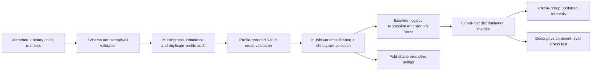
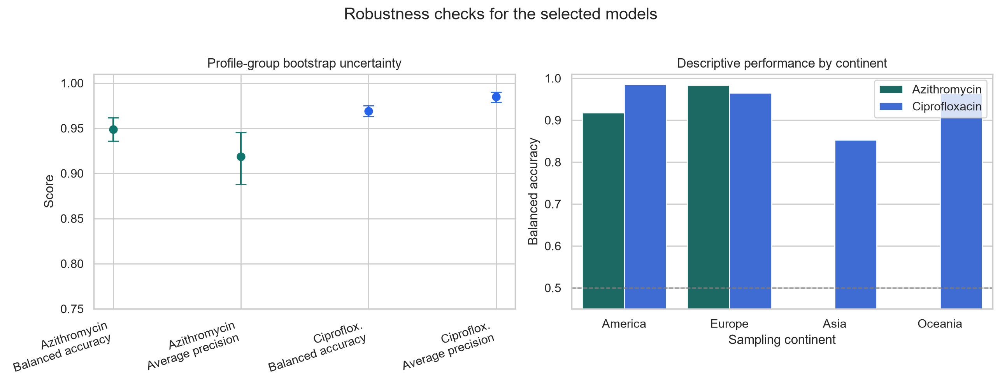
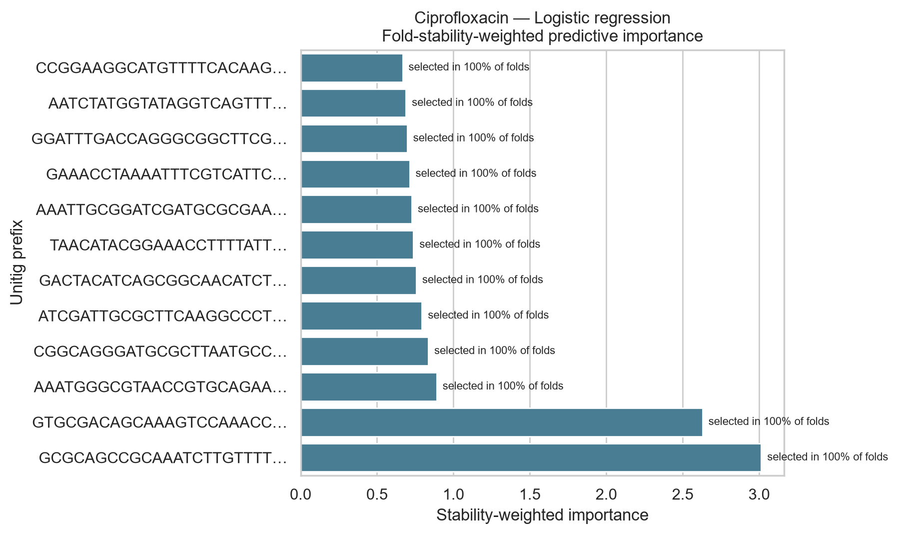

<p align="center">
  
</p>

<p align="center">
  <a href="https://github.com/itsEkramah/N.Gonorrhoeae-AMR-prediction-ML/actions/workflows/reproducibility.yml"></a>
  
  
  
</p>

<p align="center">
  <strong>A leakage-aware, reproducible reanalysis of bacterial genomic predictors of antimicrobial resistance.</strong><br>
  3,786 metadata records · group-aware cross-validation · in-fold feature selection · uncertainty and subgroup analysis
</p>

> **Course context:** Bioinformatics Computing II semester project. The repository retains the original submitted notebook and documents a subsequent reproducibility-focused revision of the analysis.

## Research snapshot

Antimicrobial resistance in *Neisseria gonorrhoeae* is a major genomic surveillance problem. This project asks whether binary genomic unitigs can distinguish resistant from susceptible isolates while confronting the issues that make microbial machine learning deceptively difficult: phenotype imbalance, duplicate genomic profiles, leakage-prone feature selection, and uneven sampling across populations.

The primary deliverable is the fully executed notebook:

> **[`N_gonorrhoeae_AMR_reproducible_analysis.ipynb`](N_gonorrhoeae_AMR_reproducible_analysis.ipynb)** — data audit, modeling, uncertainty analysis, sampling-context stress tests, and cautious biological interpretation.

The original [`BIF_COMP_PROJECT.ipynb`](BIF_COMP_PROJECT.ipynb) is retained unchanged for provenance.

### Headline internal results

| Antibiotic | Labeled isolates | Resistant | Selected model | Balanced accuracy | Profile-bootstrap 95% interval | Average precision |
|---|---:|---:|---|---:|---:|---:|
| Azithromycin | 3,478 | 447 | Class-weighted logistic regression | **0.949** | 0.936–0.962 | **0.919** |
| Ciprofloxacin | 3,088 | 1,428 | Class-weighted logistic regression | **0.969** | 0.963–0.975 | **0.985** |
| Cefixime | 3,401 | 5 | Descriptive audit only | — | — | — |

These are out-of-fold estimates from internal cross-validation, not clinical or external-validation results. The supplied matrices were already GWAS-filtered, so upstream selection leakage cannot be excluded; see [Scientific boundaries](#scientific-boundaries).

## From raw files to defensible evidence



The central design decision is to group isolates with identical complete unitig profiles. This prevents an exact duplicate profile from appearing in both training and test folds. Constant-feature removal and selection of at most 500 unitigs occur inside each training fold through a scikit-learn pipeline.

## What the robustness checks add

<p align="center">
  
</p>

The selected models were assessed with 500 profile-group bootstrap resamples. The resulting intervals quantify sampling variability without pretending to solve upstream filtering bias.

The same out-of-fold predictions were also stratified by continent where at least 100 isolates and 25 observations per class were available. Ciprofloxacin balanced accuracy ranged from **0.853 in the Asian subset** to **0.985 in the American subset**. This is a useful warning: strong aggregate performance can conceal population-specific degradation. These subgroup estimates are descriptive and are not leave-one-continent-out validation.

<details>
<summary><strong>Complete performance metrics</strong></summary>

| Antibiotic | Model | Balanced accuracy | Sensitivity | Specificity | F1 | MCC | ROC AUC | Average precision |
|---|---|---:|---:|---:|---:|---:|---:|---:|
| Azithromycin | Logistic regression | 0.949 | 0.926 | 0.971 | 0.872 | 0.854 | 0.983 | 0.919 |
| Azithromycin | Random forest | 0.915 | 0.855 | 0.976 | 0.847 | 0.824 | 0.978 | 0.877 |
| Azithromycin | Prevalence baseline | 0.500 | 0.000 | 1.000 | 0.000 | 0.000 | 0.499 | 0.128 |
| Ciprofloxacin | Logistic regression | 0.969 | 0.973 | 0.965 | 0.966 | 0.937 | 0.990 | 0.985 |
| Ciprofloxacin | Random forest | 0.967 | 0.973 | 0.961 | 0.964 | 0.933 | 0.990 | 0.982 |
| Ciprofloxacin | Prevalence baseline | 0.500 | 0.000 | 1.000 | 0.000 | 0.000 | 0.500 | 0.462 |

Exact machine-readable values are in [`results/tables/model_metrics_summary.csv`](results/tables/model_metrics_summary.csv).

</details>

## Data audit

The local data snapshot contains 3,786 metadata rows and three phenotype-specific unitig matrices:

| Matrix | Unitigs | Sample columns | Missing phenotype labels | Constant unitigs after matching |
|---|---:|---:|---:|---:|
| Azithromycin | 515 | 3,971 | 308 | 25 |
| Ciprofloxacin | 8,873 | 3,971 | 698 | 390 |
| Cefixime | 384 | 3,971 | 385 | 22 |

Important quality findings:

- 688 azithromycin rows belonged to 236 duplicate-profile groups; five groups had conflicting labels.
- 20 ciprofloxacin rows belonged to 10 duplicate-profile groups; none had conflicting labels.
- 1,729 cefixime rows belonged to 416 duplicate-profile groups; one group had conflicting labels.
- Cefixime contained only five resistant isolates and was therefore excluded from comparative modeling.
- Country, year, MIC values, other antibiotic labels, and epidemiological metadata were not used as predictors.

The complete audit is in [`results/tables/data_audit.csv`](results/tables/data_audit.csv).

## Modeling decisions

| Risk | Design response |
|---|---|
| Exact-profile leakage | `StratifiedGroupKFold` grouped by the complete unitig profile |
| Feature-selection leakage | `VarianceThreshold` and `SelectKBest(chi2)` fitted inside each fold |
| Class imbalance | Class-weighted estimators plus balanced accuracy, MCC and precision–recall metrics |
| Unrealistic synthetic genomes | No SMOTE or interpolation of binary unitig profiles |
| Optimistic model selection | Small prespecified comparison: baseline, logistic regression, random forest |
| Uncertainty hidden by point scores | Profile-group bootstrap percentile intervals |
| Population heterogeneity | Transparent descriptive subgroup analysis with minimum support rules |

## Predictive unitigs, not claimed mechanisms

<p align="center">
  
</p>

Unitig importance is aggregated across folds and weighted by selection stability. The output identifies predictive associations only. No unitig is assigned to *gyrA*, *parC*, *penA*, or another resistance locus without a documented alignment and validation workflow.

## Reproduce the analysis

Python 3.13 and the exact verified package versions are listed in [`requirements.txt`](requirements.txt).

```bash
git clone https://github.com/itsEkramah/N.Gonorrhoeae-AMR-prediction-ML.git
cd N.Gonorrhoeae-AMR-prediction-ML
python -m venv .venv
```

Activate the environment on Windows:

```powershell
.\.venv\Scripts\Activate.ps1
python -m pip install --upgrade pip
python -m pip install -r requirements.txt
python -m jupyter lab
```

Or on macOS/Linux:

```bash
source .venv/bin/activate
python -m pip install --upgrade pip
python -m pip install -r requirements.txt
python -m jupyter lab
```

Open the primary notebook and select **Restart Kernel → Run All Cells**. A non-interactive check is also available:

```bash
python -m jupyter nbconvert --to notebook --execute --inplace \
  N_gonorrhoeae_AMR_reproducible_analysis.ipynb \
  --ExecutePreprocessor.timeout=1800
```

The GitHub Actions workflow repeats a fresh-kernel execution on every push and pull request.

## Repository map

```text
├── N_gonorrhoeae_AMR_reproducible_analysis.ipynb  # primary executed analysis
├── BIF_COMP_PROJECT.ipynb                         # preserved original notebook
├── build_reproducible_notebook.py                 # deterministic notebook builder
├── DATA/                                          # supplied metadata and unitig matrices
├── results/
│   ├── figures/                                   # publication-style visual summaries
│   └── tables/                                    # audits, predictions and exact metrics
├── assets/                                        # repository visual identity
├── requirements.txt                               # verified dependencies
└── .github/workflows/reproducibility.yml          # automated fresh-kernel check
```

The original submitted notebook is retained for provenance; obsolete intermediate notebooks, debug files, caches, and unused prototype modules have been removed from the current tree. They remain recoverable through Git history. See [`USER_GUIDE.md`](USER_GUIDE.md) for the short navigation guide and [`results/README.md`](results/README.md) for the result dictionary.

## Methods and skills practiced

- Translating a biological AMR question into a supervised-learning design.
- Working with high-dimensional bacterial genomic presence/absence data.
- Leakage-aware cross-validation and reproducible scikit-learn pipelines.
- Evaluation under class imbalance using discrimination, precision–recall, and correlation metrics.
- Cluster-aware uncertainty estimation and subgroup heterogeneity analysis.
- Critical distinction between statistical prediction and biological mechanism.
- Reproducible scientific communication through an executable notebook, versioned outputs, and automated verification.

## Scientific boundaries

The input filenames identify the matrices as `gwas_filtered`. The unfiltered unitig matrix and original GWAS training splits are not supplied, so phenotype-informed upstream feature selection may have occurred before this analysis. Internal scores may therefore be optimistic. A stronger generalisation study requires unfiltered features with all selection confined to training data, plus an independent temporal, geographic, or lineage-aware test cohort.

No BLAST alignment, reference-genome mapping, population-structure correction, or experimental validation is available. This repository must not be used for diagnosis, treatment selection, or claims of a newly validated resistance mechanism.

## Dataset and attribution

The files in `DATA/` contain the metadata and phenotype-filtered unitig matrices used in this project. Their unitig representation is consistent with the graph-based approach described in the open-access [DBGWAS paper](https://doi.org/10.1371/journal.pgen.1007758).

The repository does not establish a separate licence for the supplied data. Verify the source terms before redistributing or reusing the dataset outside this project.

## Contribution statement

This repository documents a Bioinformatics Computing II semester project and a later reproducibility-focused revision of its analysis. The work covers data auditing, leakage-aware evaluation, executable analysis, uncertainty estimation, subgroup stress testing, and cautious scientific interpretation. It does not claim creation of the dataset or discovery of a validated clinical resistance mechanism.
